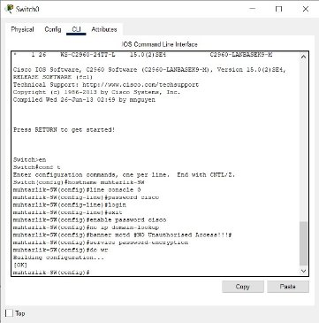

**Belediye Binası Ağ Tasarımı**

1. **Proje Tanımı ve Amacı**

Bir belediye binasında, 855 personel istihdam edilmektedir. Son zamanlarda genişledikleri için yeni bir binaya taşınmaları gerekmektedir. Bir bina belirlendiği ancak ağı olmadığı için yeni binada tasarlanıp uygulanacak yeni bir ağ hizmetine ihtiyaç duyulmaktadır. Yeni bina dört katlı olacak ve her birinde iki departman olacaktır:

1. Birinci kat - (Muhtarlık İşleri-120 kullanıcı beklenmektedir, Yazı İşleri-120 kullanıcı beklenmektedir).
1. İkinci kat - (Kültür İşleri-120 kullanıcı beklenmektedir, Kentsel Dönüşüm-120 kullanıcı beklenmektedir).
1. Üçüncü kat - (Strateji Geliştirme (ARGEM)-120 kullanıcı beklenmektedir, Temizlik İşleri-120 cihaz beklenmektedir).
1. Dördüncü kat - (Bilgi İşlemleri-120 kullanıcı beklenmektedir, Sunucu Odası-15 cihaz beklenmektedir).

Belediye binasının mevcut iş ihtiyacını karşılayan ve geleceğe yönelik hazır bir ağın mantıksal tasarımı gerekmektedir. Bunun için uygulanan adımlar özetle şu şekilde sıralanabilir:

- Cisco Packet Tracer kullanarak ağ çözümünü tasarlanacak ve uygulanacaktır. 
- Her katman için yedeklilik sağlayan hiyerarşik model kullanılacak, yani yedeklilik sağlamak için iki router ve iki multilayer switchin kullanılması beklenecektir. 
- Ağ, ayrıca yedeklilik sağlamak için en az iki ISP'ye bağlanılacak ve her router iki ISP'ye bağlanılacaktır. 
- Her departmanın kullanıcıları için kablosuz ağa ihtiyacı vardır. 
- Her departman farklı bir VLAN'da ve farklı bir alt ağda olacaktır. 
- 192.168.1.0 temel ağı sağlanmış olup, her departmana doğru IP adresi sayısını tahsis etmek için alt ağlar kullanılacaktır. 
- Belediye ağı, iki ISP’ye bağlı 195.136.17.0/30, 195.136.17.4/30, 195.136.17.8/30 ve 195.136.17.12/30 public IP adreslerine (Internet Protocol) bağlıdır. 
- Temel cihaz ayarları, temel cihaz adları, konsol şifreleri, etkin şifreler, banner mesajları, IP etki alanı arama işlemlerini devre dışı bırakma gibi temel cihaz ayarları yapılandırılacaktır. 
- Tüm bölümlerdeki cihazların, ilgili multilayer switchler aracılığıyla birbirleriyle iletişim kurması gerekecektir. 
- Multilayer switchler, hem yönlendirme hem de anahtarlamayı gerçekleştirmesi beklenmektedir, bu nedenle bunlara IP adresleri atanacaktır. 
- Ağdaki tüm cihazların özel DHCP sunucularından dinamik olarak bir IP adresi alması beklenir. 
- Sunucu odasındaki cihazlara IP adresi statik olarak atanacaktır. 
- Routing protokolü olarak OSPF kullanılacak ve rotaları hem yönlendiricilerde hem de multilayer switchler üzerinden tanıtılacaktır.
- Uzaktan oturum açma için tüm yönlendiricilerde ve üçüncü katman anahtarlarında SSH yapılandırılacaktır. 
- PAT'ı, ilgili çıkış yönlendirici arayüzü IPv4 adresini kullanacak şekilde yapılandırılacak ve gerekli ACL kuralını uygulanacaktır. 
- Multilayer switchler ve core routerlara IP routing (yönlendirme) işlemleri yapılacaktır.
- Tüm yapılandırmaların beklenildiği gibi çalıştığından emin olmak için iletişimi test edilecektir.

1. **Uygulanan Teknolojiler**
1. Cisco Packet Tracer Kullanarak Bir Ağ Topolojisi Oluşturma.
1. Hiyerarşik Ağ Tasarımı.
1. Doğru Kablolama ile Ağ Cihazlarının Bağlantılandırılması.
1. Temel Cihaz Ayarlarının Yapılandırılması.
1. VLAN'ların Oluşturulması ve Portlara VLAN Numaralarının Atanması.
1. Alt Ağlara Bölme ve IP Adresleme İşlemleri.
1. Multilayer Switchler Üzerindeki Inter-VLAN Yönlendirmenin Yapılandırılması (Anahtar Sanal Arayüzü).
1. Dinamik IP Ataması Yapmak İçin Özel DHCP Sunucu Cihazının Yapılandırılması.
1. Güvenli Uzak Erişim İçin SSH Yapılandırılması.
1. Routing Protokolü Olarak OSPF'nin Yapılandırılması.
1. PAT Olarak NAT Overload'un Yapılandırılması.
1. WLAN veya Kablosuz Ağın Yapılandırılması (Cisco Erişim Noktası).
1. Ana Bilgisayar Cihazı Yapılandırmaları.
1. ISP Yönlendiricilerinin Yapılandırılması.
1. Multilayer Switch ve Routerlara IP Routing (Yönlendirme) Yapılması
1. Ağ İletişimini Test Etme ve Doğrulama. 

**Önizleme**

*Şekil 1. Uygulama Görünümü*

1. **Proje Aşamaları**
**

1. **Doğru Kablolama ile Ağ Cihazlarının Bağlantılandırılması**

`      `***Cisco Packet Tracer uygulamasında kullanılan cihazlar:*** 

- İnternet servis sağlayıcı (ISP) olarak görevlendirilen 2 router,
- ISP ile iletişim yollarını yönlendiren 2 adet merkezi (core) router,
- Core router ile departmanlardaki switchlerle iletişimi yönlendirmek üzere görevlendirilen 2 adet multilayer switch,
- Her katta bulunan iki departman için 2 switch kullanılmak üzere toplamda 8 adet switch,
- Her kattaki departmanlarda bir adet PC, bir adet printer, bir adet Access pointer, bir adet laptop ve bir adet tablet kullanılmıştır.

***Cihazlar arasında kullanılan kablo tipleri:***

- ISP ve core routerlar arasında serial DCE kablo tipi kullanılmıştır.
- Core router ve multilayer switch arasında copper straight-through tipi kablo kullanılmıştır.
- Multilayer switch ve departmanlardaki switchler arasında copper cross-over tipi kablo kullanılmıştır.

*Şekil 2. Uygulamanın Cihaz ve Kablolama Görünümü*

1. **Temel Cihaz Ayarlarının Yapılandırılması**

ISP’ler, Multilayer switchler ve core routerların AC Power kablosu ilgili porta takılıp kabloların port durumları (port status) aktif edildi. 

Cihazların CLI kısmından hostname ve şifre isimleri sırasıyla cihaz adı ve “cisco” olacak şekilde atandı. 

`         `  

*Şekil 3 ve 4. Switch ve Multilayer Cihazlarının Yapılandırılması*

*Şekil 5. Router Cihazının Yapılandırılması*

1. **VLAN'ların Oluşturulması ve Portlara VLAN Numaralarının Atanması**

*Şekil 6. Muhtarlık Departmanında VLAN Oluşturulması*

*Şekil 7. Yazı İşleri Departmanında VLAN Oluuşturulması*

*Şekil 8. Multilayer Switch Arayüzlerinde Trunk Modunun Açılması*

*Şekil 9. Multilayer Switchlerine VLAN Tanımlaması*

Şekil 6 ve 7’de her departmandaki switch’e vlan tanımlanması görülmektedir. Bu adımdan sonra Multilayer1 ve 2 de trunk modu açılıp departmanların vlan isimleri ve numaraları atanmaktadır.

1. **Alt Ağlara Bölme ve IP Adresleme İşlemleri**

Ağdaki tüm cihazların, sunucu kökünde bulunan özel DHCP sunucularından dinamik olarak bir IP adresi alması beklenmektedir. Ancak sunucu odasındaki cihazlara statik olarak IP adresi atanmaktadır.  Base Network: 192.168.1.0

**İlk Kat**

|**Müdürlükler**|**Network Adresi**|**Subnet Mask**|**Host Adres Aralığı**|**Broadcast Adresi**|
| :-: | :-: | :-: | :-: | :-: |
|Muhtarlık İşlemleri|192\.168.1.0|255\.255.255.128/25|
192\.168.1.1 –

192\.168.1.126
|192\.168.1.127|
|Yazı İşleri|192\.168.1.128|255\.255.255.128/25|
192\.168.1.129 –

192\.168.1.254
|192\.168.1.255|

**İkinci Kat**

|**Müdürlükler**|**Network Adresi**|**Subnet Mask**|**Host Adres Aralığı**|**Broadcast Adresi**|
| :-: | :-: | :-: | :-: | :-: |
|Kültür İşleri|192\.168.2.0|255\.255.255.128/25|
192\.168.2.1 –

192\.168.2.126
|192\.168.2.127|
|Kentsel Dönüşüm|192\.168.2.128|255\.255.255.128/25|
192\.168.2.129 –

192\.168.2.254
|192\.168.2.255|

**Üçüncü Kat**

|**Müdürlükler**|**Network Adresi**|**Subnet Mask**|**Host Adres Aralığı**|**Broadcast Adresi**|
| :-: | :-: | :-: | :-: | :-: |
|Strateji Geliştirme (ARGEM)|192\.168.3.0|255\.255.255.128/25|
192\.168.3.1 –

192\.168.3.126
|192\.168.3.127|
|Temizlik İşleri|192\.168.3.128|255\.255.255.128/25|
192\.168.3.129 –

192\.168.3.254
|192\.168.3.255|

**Dördüncü Kat**

|**Müdürlükler**|**Network Adresi**|**Subnet Mask**|**Host Adres Aralığı**|**Broadcast Adresi**|
| :-: | :-: | :-: | :-: | :-: |
|Bilgi İşlemleri|192\.168.4.0|255\.255.255.128/25|
192\.168.4.1 –

192\.168.4.126
|192\.168.4.127|
|Sunucu Odası |192\.168.4.128|255\.255.255.240/28|
192\.168.4.129 –

192\.168.4.145
|192\.168.4.146|

*Tablo 1. Alt Ağlara Bölme ve IP Adresleme İşlemleri*

**Dördüncü Katman Switchleri (Multilayer Switch) ve Core Routerlar Arası IP Adresleme**

|**Müdürlükler**|**Network Adresi**|**Subnet Mask**|**Host Adres Aralığı**|**Broadcast Adresi**|
| :-: | :-: | :-: | :-: | :-: |
|R1 – MLSW1|172\.16.3.144|255\.255.255.252|
172\.16.3.145 –

172\.16.3.146
|172\.16.3.147|
|R1 – MLSW2|172\.16.3.148|255\.255.255.252|
172\.16.3.149 –

172\.16.3.150
|172\.16.3.151|
|R2 – MLSW1|172\.16.3.152|255\.255.255.252|
172\.16.3.153 –

172\.16.3.154
|172\.16.3.155|
|R2 – MLSW2|172\.16.3.156|255\.255.255.252|
172\.16.3.157 –

172\.16.3.158
|172\.16.3.159|

*Tablo 2. Multilayer Switch ve Router Arası IP Adresleme İşlemleri*

**Core Router ve ISP’ler Arası IP Adresleme**

Public IP adres :

- 195.136.17.0/30
- 195.136.17.4/30
- 195.136.17.8/30
- 195.136.17.12/30

*Şekil 10. Multilayer Switch1’e IP Ataması*

Şekil 10’da Multilayer Switch 1’e Tablo 2’deki network adresi 172.16.3.144 olduğu için 172.16.3.145 ip adresi atandığı görülmektedir. Network adresinin bir fazlası şeklinde diğer ip adreslemeler de tamamlanmaktadır.

*Şekil 11. Multilayer Switch2’ye IP Ataması*

*Şekil 12. Core Router1’e IP Ataması*

*Şekil 13. Core Router2’ye IP Ataması*

*Şekil 14. ISP1’e IP Ataması*

*Şekil 15. ISP2’ye IP Ataması*

Cisco Packet Tracer'da bir ISP simüle etmek için "Cloud" (Bulut) bileşeni kullanılmaktadır. Bu bileşen, dış ağ kaynaklarına erişim sağlamak için kullanılır ve İnternet Servis Sağlayıcısı (ISP) olarak temsil edilmektedir. Şekil 14 ve 15’ de ISP1 ve ISP2’ye arayüz numaraları dikkate alınarak uygun ip adresleme işlemleri yapılmaktadır.

1. **Routing Protokolü Olarak OSPF'nin Yapılandırılması**

*Şekil 16. Multilayer Switch2 Routing İşlemleri*

*Şekil 17. Multilayer Switch1 Routing İşlemleri*

*Şekil 18. Core Router1 Routing İşlemleri*

1. **Sunucu Odasındaki Cihazlara Statik IP Adres Atama**

*Şekil 18. DHCP-Server Statik IP Atama İşlemi*

*Şekil 19. Email-Server Statik IP Atama İşlemi*

*Şekil 20. DNS-Server Statik IP Atama İşlemi*

Sunucu odasındaki cihazlara statik olarak IP atanmaktadır. Sunucu odasında, sunucuların genellikle önemli bir rolü vardır ve ağda sürekli olarak kullanılabilir olmaları gereklidir. Bu nedenle, sunuculara statik IP adresleri atanır. Statik IP adresleri, cihazlar arasında sabit bir kimlik oluşturur ve bu kimlik, sunucuların ağda her zaman kolayca tanınmasını sağlar.

Alt ağlara bölme işleminde dördüncü kattaki sunucu odasının networkü 192.168.4.128 olarak belirlenmişti. Bu sebeple DHCP-Server, Email-Server ve DNS-Server’a sırasıyla 192.168.4.130, 192.168.4.133, 192.168.4.131 adresleri atanmaktadır. Default gateway adresleri iletişim kurulacak switchin ip adresini belirtmektedir.

1. **DHCP Servis Yapılandırılması ve DNS Servis Domain Name Belirleme**

*Şekil 21. DHCP-Server Servis İşlemleri*

Şekil 21’de DHCP Server içinde DHCP servisi aktif edilerek departmanların pool name, default gateway, dns server, başlangıç ip adresi, subnet mask ve o departmanın alabileceği maksimum kullanıcı sayısının girişi yapılmaktadır. Daha sonra her departmandaki cihazların desktop IP Configuration kısmından static olarak seçilen kısmı DHCP olarak seçilerek dinamik IP atamasını gerçekleştirildi.

*Şekil 22. DNS-Serverda DNS Servisini Aktif Etme*

1. **Multilayer Switchler Üzerindeki Inter-VLAN Yönlendirmenin Yapılandırılması (Anahtar Sanal Arayüzü)**

*Şekil 23. Multilayer Switch1 Inter-VLAN Yönlendirmenin Yapılandırılması*

Inter VLAN yönlendirmesi, farklı VLAN'larda bulunan cihazlar arasında iletişim kurmak için kullanılan bir tekniktir. VLAN'lar, ağda ayrı ayrı segmentler oluşturarak ağın daha iyi yönetilmesini sağlar. Ancak, VLAN'lar arasında doğrudan iletişim olmadığı için inter VLAN yönlendirmesi gereklidir.

Inter VLAN yönlendirmesi, ağdaki Multilayer Switch1 tarafından gerçekleştirilmektedir. Bu cihazlar, farklı VLAN'lar arasında trafiği yönlendirerek cihazların birbirleriyle iletişim kurmasını sağlar. Bu işlem, paketleri bir VLAN'dan diğerine taşıyarak ve VLAN taglerını kullanarak gerçekleştirilir.

1. **WLAN veya Kablosuz Ağın Yapılandırılması** 

*Şekil 24. Accesspointer için Kablosuz Ağı İsimlendirme ve Şifreleme*

*Şekil 25. Laptopu Kablosuz Ağa Bağlama*

WPA2-PSK (Wi-Fi Protected Access 2 with Pre-Shared Key), Wi-Fi ağlarının güvenliğini sağlamak için kullanılan bir şifreleme protokolüdür. WPA2-PSK, ağ trafiğini şifreleyerek, ağa yetkisiz erişimi önlemeye yardımcı olur.

1. **PAT (Port Address Translation) Olarak NAT Overload'un Yapılandırılması**

*Şekil 26. Core Router1 PAT İşlemleri*

*Şekil 27. Core Router2 PAT İşlemleri*

PAT yapılandırması için "ip nat inside" ve "ip nat outside" komutlarını kullanarak iç ve dış arayüzleri belirttik. Bu yapılandırma, iç ağdaki bir dizi IP adresini, tek bir IP adresi ve port numarası kombinasyonuyla dış ağa çevirir. Bu sayede iç ağdaki birçok cihazın aynı anda internete erişimi sağlanmış olur.

1. **Ağ İletişimini Test Etme ve Doğrulama**

*Şekil 28.1. ISP1’den Ping Atma Örneği*

*Şekil 29.2. ISP2’den Ping Atma Örneği*

*Şekil 30. ARGEM Departmanından Muhtarlık Departmanına Ping Atma*

        

*Şekil 31.1 ve 32.2. Başarılı Bir Email Gönderim Örneği*

1. **Sonuç ve Tartışma**

Bu çalışmada Router, switch, Access pointer, PC, laptop, tablet, printer ve gerekli sunucular içeren bir geniş alan ağı ve yerel alan ağları gerçekleştirilmiştir. Bu ağ topolojisi gerçeklenmesi sırasında Packet Tracer yazılımı kullanılmış ve gerçek Router, switch programlaması ile özdeş cihaz programlaması yapılmıştır. VLANLAR tanımlanmış bu VLANlar gerekli cihazlara konfigüre edilmiştir. PC’ler için sunucu odası haricindeki departmanlara DHCP havuzları tanımlanmış ve PC’lerin IP’leri aldığı gözlemlenmiştir. DNS sunucu tanımlanmıştır ve DHCP havuzları üzerinden PC’lere dağıtılmıştır. EMAİL sunucu tanımlanmış ve erişim gözlemlenmiştir. Hayali bir geniş ağ oluşturularak ISP tanımlanmıştır. Geniş bir ağda ve yerel bir ağda olması gereken temel cihazlar ve protokoller kullanılmıştır. Hem statik hem de dinamik IP konfigürasyonları eş zamanlı simüle edilmiştir. Simülasyon sonuçları ağda herhangi bir paketin kaynak ile hedef arasında problemsiz ulaşabildiği gösterilmiştir.

1. **Kaynakça**

[1] T. Lammle, “CCNA: Cisco certified network associate study guide”, 5th Edition, SYBEX Press, 2003.

[2] D. Barnes, B. Sakandar, “Cisco LAN Switching Fundamentals”, CISCO Press.

[3] <https://www.netacad.com/courses/packet-tracer> (Erişim zamanı: 10.05.2023).
20

